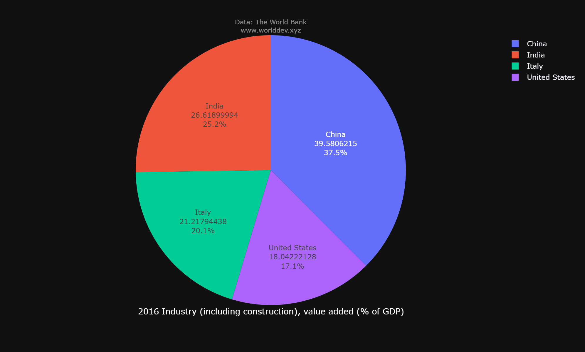

### NAME- MANISH BHIMA
# Factors that influence the economy and growth of a country
## INDICATORS:
- Exports of goods and services (% of GDP)
- Trade (% of GDP)
- Industry (including construction), value added (% of GDP)
- GDP per capita, PPP (current international $)

## Countries compared:
- India
- United states
- Italy
- China
## Introduction:
- Economic growth is defined as a rise or improvement in the market value of an economy's commodities and services through time. This expansion is likewise proportional to the percent rate of rise in real Gross Domestic Product (GDP).
# Economic growth due to exports of goods and services:
-  Export sales growth generates revenue and earnings for firms, allowing them to boost capital expenditure. Higher investment boosts a country's production capacity, which in turn boosts its export potential.

- In the year 2016, the percentage of exports of goods and services contributing to GDP by various countries is depicted in the bar graph above.
- The Italy exports of goods and services contribute 36.7 percent to its GDP, making it the country with the highest proportion of GDP contributed by exports.
- China with 24.5 of the market, followed by India with 23.9 % and United States with 14.9%.
# Economic growth due to Industries:
- Industrial progress has generally resulted in periods of economic expansion. Increased employment opportunities are provided by industrialization, which raises community income and contributes to the country's economic progress.

