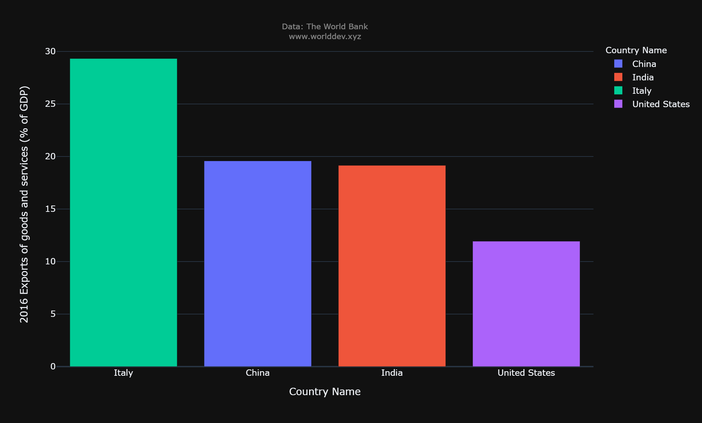

### NAME- MANISH BHIMA
# Factors that influence the economy and growth of a country
## INDICATORS:
- Exports of goods and services (% of GDP)
- Trade (% of GDP)
- Industry (including construction), value added (% of GDP)
- GDP per capita, PPP (current international $)

## Countries compared:
- India
- United states
- Italy
- China
## Introduction:
- Economic growth is defined as a rise or improvement in the market value of an economy's commodities and services through time. This expansion is likewise proportional to the percent rate of rise in real Gross Domestic Product (GDP).
# Economic growth due to exports of goods and services:
-  Export sales growth generates revenue and earnings for firms, allowing them to boost capital expenditure. Higher investment boosts a country's production capacity, which in turn boosts its export potential.

- In the year 2016, the percentage of exports of goods and services contributing to GDP by various countries is depicted in the bar graph above.
- The Italy exports of goods and services contribute 36.7 percent to its GDP, making it the country with the highest proportion of GDP contributed by exports.
- China with 24.5 of the market, followed by India with 23.9 % and United States with 14.9%.
# Economic growth due to Industries:
- Industrial progress has generally resulted in periods of economic expansion. Increased employment opportunities are provided by industrialization, which raises community income and contributes to the country's economic progress.

- China is at the top of the list, with industries accounting for 37.5 percent of its GDP. 
- India begins with 25.2 percent of GDP provided by industries and Italy is in third place with 20.1 percent at the end of 2016
- USA is having 17.1 percent of GDP provided by industries by end of 2016
# GDP per capita, PPP (current international $):
- The gross domestic product (GDP) is a metric that measures the economic output of a country. The number of goods and services produced in a country with a higher GDP will be greater.

- The United States has the highest GDP of 68.4%, while India has the lowest GDP of 8 percent, as shown in the chart above. Despite minimal contributions from exports and trade to the United States, science and technology have contributed to the country's higher GDP than other countries.
# Industrialisation vs Exports Of Goods among different Years:
 
 
 
 
 
 
 
 The above figure depicits Industrialisation vs Exports in four different countries among the different years from 2016 to 2021

### **Conclusion**

### **References**
- Wang, C. (2021). The world development explorer. Available from http://www.worlddev.xyz

